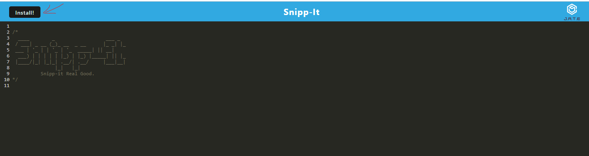
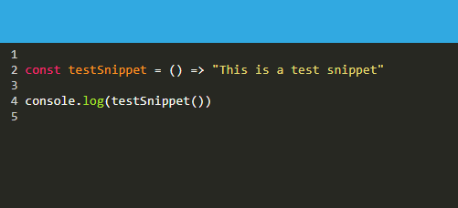

# Snipp-it

## Description

Snipp your snippets!

## Table of Contents

- [Snipp-it](#snipp-it)
  - [Description](#description)
  - [Table of Contents](#table-of-contents)
  - [Link](#link)
  - [Usage](#usage)
  - [Images](#images)
  - [Questions](#questions)
  
## Link
  - [Live App](https://snipp-it-dj.herokuapp.com/)

## Usage

To use this appliction: 
  1. Click the "Install" button to install the application to your desktop.
  2. Type your code snippet in the text editor.
  3. Simply focus out of the text editor to save your snippet.

## Images
  - ### Install
    - 

  - ### Write a Snippet!
    - 

## Questions

[My GitHub Profile](https://github.com/Deejerz88)

If you have any questions about my project, please contact me at [djmcmillan93@gmail.com](mailto:djmcmillan93@gmail.com).
